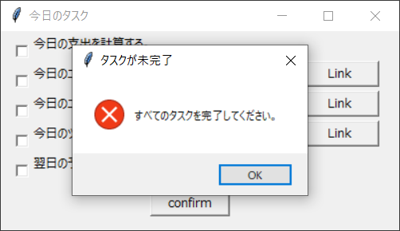

# TaskReminder
## 概要
- TODOファイル（todo.txt）に記載された項目の一覧を、ポップアップウィンドウで表示する。
- 各項目には任意のウェブサイトやディレクトリパスをリンク先として指定することもできる。
- リンク先を指定した場合は、リンク先を開くためのボタンがウィンドウに追加される。
- 確定ボタンあるいはウィンドウの閉じるボタンを押下することでウィンドウを閉じる。  
  
- ただし表示されているすべての項目のチェックボックスにチェックが入っていない状態で  
  確定ボタンを押下しても、エラーメッセージが表示されアプリを終了できない。  
  
- また、ウィンドウ右上のXボタンでアプリを終了させようとした場合も同様の動作となる。
- タスクが未完了のまま上記の方法でアプリを終了させようとすると、かなり煽られる。  
  

## 利用方法
1. todo.txtにリマインド項目およびリンク先を記載する。
    - リマインド項目には`[todo]`、リンク先には`[link]`のヘッダを付与する。
    - ヘッダが付与されていない記載事項は認識されない。
    - リンク先が不要な場合は、`[link]`ヘッダのみ記載する。
    - リマインド項目およびリンク先は、１つの記載ごとに改行する。
    ```
    /* TODOファイルのサンプル */
    [todo]今日の支出を計算する。
    [link]
    [todo]今日のニュースをチェックする。
    [link]https://www.bbc.com/japanese
    ```
2. todo.batの記載内容を修正する。
    - core.pyを保存しているディレクトリのパスをtodo.batに記載する。
3. todo.batをWindowsのタスクスケジューラに登録する。

## 制限事項
- リマインド項目の文字数について
    - 適正な文字数は、日本語・アルファベッドともに25文字。
    - 25文字以上でも設定は可能だが、動的なウィンドウサイズ変更や改行は行われない。
- リマインド項目の登録上限
    - 設定可能な項目の上限数は5。
    - 上限数を超える項目をtodo.txtに記載しても、アプリ上では表示されない。